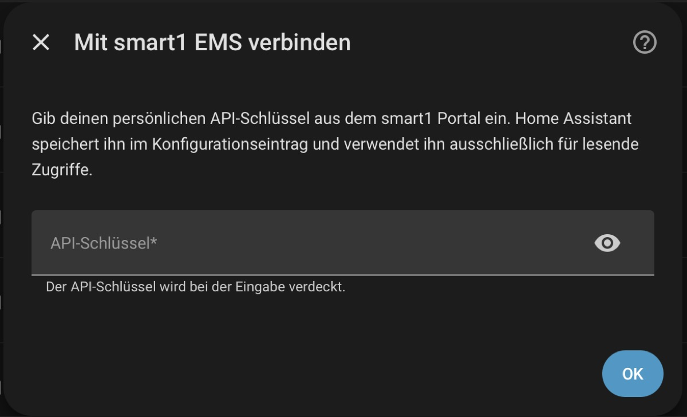
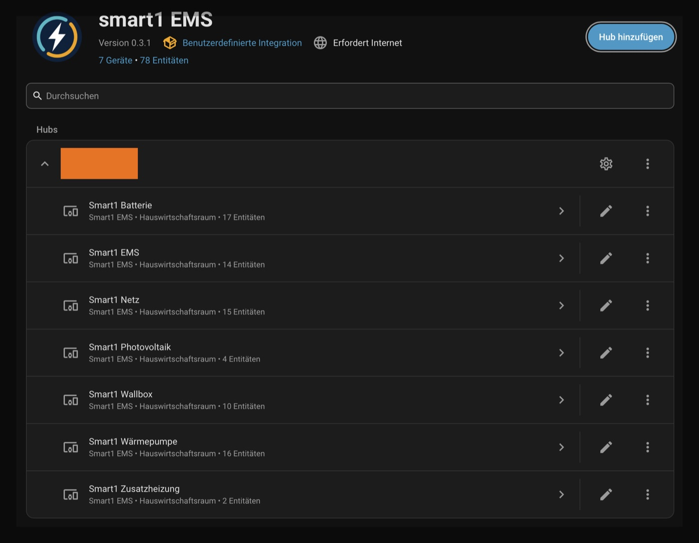
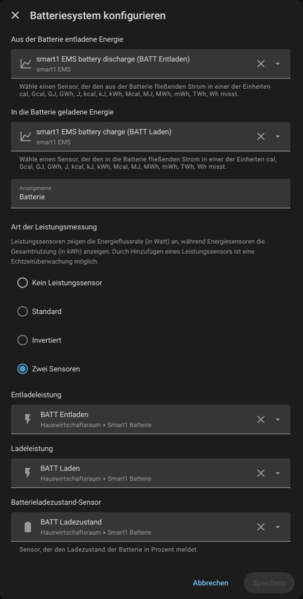

# smart1 EMS für Home Assistant

  

Eine inoffizielle, ausschließlich lesende Home-Assistant-Integration für das
smart1 Energiemanagementsystem. Sie ruft Messwerte über die CSV-API des smart1
Portals ab und bildet neben der Photovoltaikanlage auch Netzanschluss, Batterie,
Wallbox, Wärmepumpe und Zusatzheizung ab.

> **Inoffizielles Community-Projekt:** Diese Integration ist kein offizielles
> smart1 Release und weder mit smart1 verbunden noch von smart1 freigegeben. Die
> Implementierung basiert auf der
> [offiziellen Dokumentation der smart1 CSV-Portal-API](https://data.smart1.eu/s/W3M4E8EkqMAPWqL?dir=/01%20SOFTWARE%20%26%20FIRMWARE/02%20PORTAL&editing=false&openfile=true).

> Das Projekt ist eine frühe öffentliche Beta-Version. Es wurde mit einer realen
> smart1 Anlage und Home Assistant 2026.7.4 geprüft.

[English documentation](../README.md) ·
[Installation](#installation-über-hacs) ·
[Screenshots](#screenshots) ·
[Energy Dashboard](#energy-dashboard) ·
[Fehler melden](#fehler-melden) ·
[Roadmap](#roadmap)

## Auf einen Blick

| | |
| --- | --- |
| Zugriff | Ausschließlich lesendes Cloud-Polling über die offizielle CSV-Portal-API |
| Einrichtung | Home-Assistant-Oberfläche mit verdecktem persönlichem API-Schlüssel |
| Geräte | EMS, PV, Netz, Batterie, Wallbox, Wärmepumpe und Zusatzheizung |
| Energy Dashboard | PV, Netz, Batterie und ausgewählte Einzelverbraucher |
| Historie | Automatischer Import von bis zu 365 Tagen |
| Getestete Hardware | M-TEC Energy Hero, Energy Butler, Energy Heater und KEBA Wallbox |

## Funktionen

- Automatische Erkennung von Anlage und Messpunkten
- Live-Sensoren für Leistung, Energie, Temperaturen, Prozentwerte und Diagnosen
- Ladezustand der Batterie aus dem strukturierten smart1 `SOC`-Signal
- Exakte PV-Produktion aus dem dokumentierten kumulativen PV-Endpunkt
- Energy-Dashboard-Statistiken für Netz, Batterie, Wallbox, Wärmepumpe und
  Zusatzheizung
- Automatischer historischer Import im Hintergrund
- Redigierte Home-Assistant-Diagnosen ohne API-Schlüssel, Anlagen-IDs,
  Messpunkt-IDs oder Messwerte

Alle Zugriffe auf das Portal sind lesend. Die Integration stellt keine Schalter,
Befehle oder andere Steuerungsmöglichkeiten bereit.

## Screenshots

**Einrichtung mit verdecktem API-Schlüssel**

  

**Automatisch erkannte Geräte**

  

  
<strong>Batteriekonfiguration für das Energy Dashboard</strong>

  

    
  

## Kompatibilität

Die Integration verwendet die gemeinsame, offiziell dokumentierte CSV-API der
smart1 Portale. Sie sollte deshalb mit allen smart1 Portalen funktionieren, die
die dokumentierten Endpunkte und kompatible Messpunkt-Metadaten bereitstellen.
Praktisch getestet werden konnte sie bisher nur mit folgender Anlage:

- M-TEC Energy Hero EMS
- M-TEC Energy Heater Heizstab
- M-TEC Energy Butler Wechselrichter und Speicher
- KEBA Wallbox

Andere Anlagen und Hardwarekombinationen können abweichende Messpunktnamen oder
Schnittstellen-Metadaten verwenden. Diagnosen solcher Systeme helfen dabei, die
Erkennungsregeln zu erweitern.

## Installation über HACS

Bis die Integration im Standardkatalog von HACS enthalten ist, wird sie als
benutzerdefiniertes Repository hinzugefügt:

1. HACS in Home Assistant öffnen.
2. Im Drei-Punkte-Menü **Benutzerdefinierte Repositories** auswählen.
3. `https://github.com/philipp-reede/ha-smart1` als Kategorie **Integration**
   hinzufügen.
4. **smart1 EMS** suchen und herunterladen.
5. Home Assistant neu starten.

## Einrichtung

1. **Einstellungen → Geräte & Dienste** öffnen.
2. **Integration hinzufügen** wählen und nach **smart1 EMS** suchen.
3. Den persönlichen API-Schlüssel aus dem smart1 Portal eingeben. Das Feld ist
   verdeckt; der Schlüssel wird im Home-Assistant-Konfigurationseintrag
   gespeichert.
4. Falls mehrere Anlagen verfügbar sind, die gewünschte Anlage auswählen.

Die Live-Entitäten stehen anschließend zur Verfügung. Der historische Import
startet automatisch im Hintergrund und wird auch nach späteren Neustarts
ausgeführt. Der erste Import kann abhängig von der Antwortzeit des Portals
mehrere Minuten dauern.

## Energy Dashboard

Unter **Einstellungen → Geräte & Dienste → smart1 EMS → Konfigurieren** wird für
jede gewünschte Energierolle ein Leistungsmesspunkt ausgewählt. Die Integration
schlägt erkannte Messpunkte vor. Die Auswahl bleibt bewusst explizit, weil eine
smart1 Anlage mehrere Messpfade für dasselbe physische Gerät bereitstellen kann.

Danach können unter **Einstellungen → Dashboards → Energie** folgende
Statistiken hinzugefügt werden:

| Bereich | smart1 EMS Statistik |
| --- | --- |
| PV-Erzeugung | smart1 EMS PV production |
| Netzbezug | smart1 EMS grid import |
| Netzeinspeisung | smart1 EMS grid export |
| Batterieladung | smart1 EMS battery charge |
| Batterieentladung | smart1 EMS battery discharge |
| Einzelgeräte | Wallbox, Wärmepumpe und Zusatzheizung |

Die PV-Gesamtsumme stammt aus dem dokumentierten kumulativen Endpunkt und wird
anhand des gemessenen 5-Minuten-Leistungsprofils auf Stunden verteilt. Dadurch
bleibt die exakte Tagessumme erhalten und die stündliche Energieverteilung ist
zeitlich konsistent.

Die übrigen Energiewerte sind Schätzungen aus 5-Minuten-Leistungswerten. Lücken
von mehr als 15 Minuten werden nicht überbrückt. Unvollständige Portaldaten
können deshalb zu niedrigeren Summen führen.

## Fehler melden

Bei Problemen bitte die Home-Assistant-Version, die Integrationsversion,
relevante Protokollmeldungen und möglichst die Diagnose der smart1 EMS
Integration im [GitHub Issue-Tracker](https://github.com/philipp-reede/ha-smart1/issues)
angeben. Die Integration entfernt API-Schlüssel, Anlagen- und Messpunkt-IDs
sowie Messwerte aus ihrer Diagnose. Vor einer öffentlichen Weitergabe sollte
die Datei dennoch geprüft werden.

## Bekannte Einschränkungen

- Die Verfügbarkeit der Daten hängt vom smart1 CSV-Portal ab.
- Historische Energiewerte außerhalb der PV-Anlage werden aus
  5-Minuten-Leistungswerten berechnet, weil die getestete Anlage keine
  verwendbaren linearen Summenzähler über den kumulativen Endpunkt liefert.
- Ungewöhnliche Messpunktnamen oder Schnittstellen-Metadaten können zusätzliche
  Zuordnungsregeln erfordern.
- Die Integration ist ausschließlich lesend und kann weder das EMS noch
  angeschlossene Geräte steuern.

## Roadmap

- Erkennung und Gerätezuordnung mit weiteren smart1 Portalen und
  Hardwarekombinationen validieren
- Optionale Wechselrichter- und PV-String-Diagnosen aus den dokumentierten
  Endpunkten untersuchen, darunter AC-/DC-Leistung, DC-Spannung und
  Wechselrichtertemperatur
- Den Zeitraum des historischen Imports bei Bedarf konfigurierbar machen
- Nach breiterer Praxiserprobung die Aufnahme in den HACS-Standardkatalog
  beantragen

## Projekt unterstützen

Wenn dir die Integration hilft, kannst du ihre Weiterentwicklung hier
unterstützen:

Weitere technische Details stehen in den englischen
[`API_NOTES.md`](../API_NOTES.md).

## Lizenz

Dieses Projekt steht unter der [MIT-Lizenz](../LICENSE).
